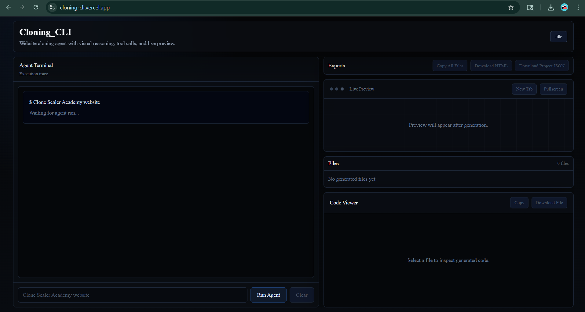
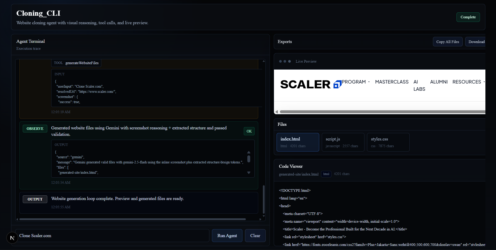
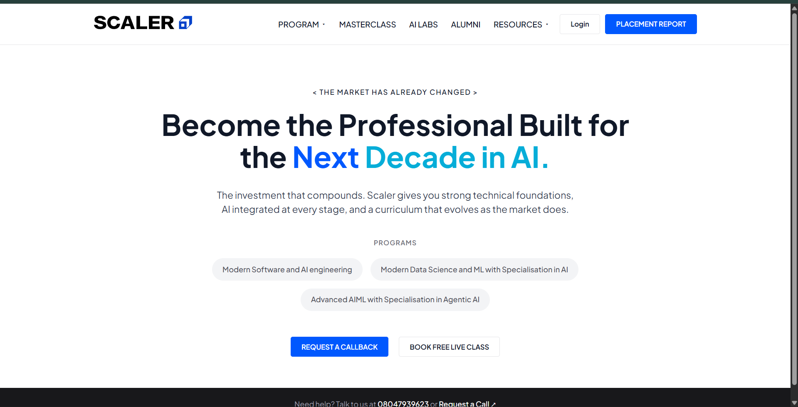

# Cloning_CLI

Cloning_CLI is a Next.js-based website cloning agent dashboard that accepts a website prompt, resolves the target URL, fetches page data, captures a screenshot, extracts structure/design hints, and generates a simplified HTML/CSS/JS landing-page clone with live preview.

## Live Demo

https://cloning-cli.vercel.app/

## Screenshots

Dashboard idle state



Agent run completed with generated files



Generated Scaler-style landing page preview



## Features

- Cursor-style agent dashboard
- Visible `START` / `THINK` / `TOOL` / `OBSERVE` / `OUTPUT` execution trace
- URL resolution from natural language prompts
- Website HTML/CSS extraction
- Screenshot capture using Microlink
- Screenshot + extracted structure grounded generation
- Generates `index.html`, `styles.css`, and `script.js`
- Live preview
- Code viewer
- Copy/download exports
- Local fallback when generation fails

## Tech Stack

- Next.js App Router
- TypeScript
- Tailwind CSS
- Vercel
- Microlink screenshot capture
- LLM-powered generation layer

The current implementation uses environment-configured model settings. The generation layer can be adapted for multimodal providers such as Gemini, GPT, Claude/Anthropic, or equivalent models.

## How It Works

1. User enters a website cloning prompt.
2. The app resolves the target URL.
3. The backend fetches HTML and linked CSS.
4. The backend captures a screenshot.
5. The extractor collects nav links, headings, buttons, footer hints, and design tokens.
6. The generation layer creates HTML/CSS/JS from screenshot + extracted structure.
7. The validator checks structure and theme consistency.
8. Fallback template is used if generation fails.
9. The dashboard renders generated files and live preview.

## Agent Loop

```text
START
THINK: Resolve target website
TOOL: resolveWebsiteUrl
OBSERVE: URL resolved
THINK: Fetch page data
TOOL: fetchWebsiteHTML
OBSERVE: HTML fetched
THINK: Capture screenshot
TOOL: captureWebsiteScreenshot
OBSERVE: Screenshot captured
THINK: Generate files
TOOL: generateWebsiteFiles
OBSERVE: Files generated
OUTPUT: Preview ready
```

## Local Setup

```bash
npm install
npm run dev
```

## Environment Variables

```bash
GEMINI_API_KEY=
GEMINI_MODEL=
SCREENSHOT_PROVIDER=microlink
```

- `GEMINI_*` variables are used by the current generation implementation.
- `SCREENSHOT_PROVIDER=microlink` enables public Microlink screenshot capture.
- API keys must stay server-side.

## Production Build

```bash
npm run build
```

## Deployment

The app is deployed on Vercel.

To deploy your own:

- Push repository to GitHub.
- Import the repo into Vercel.
- Add environment variables.
- Deploy.

## Assignment Mapping

| Requirement | Implementation |
| --- | --- |
| Conversational CLI-style agent | Terminal-style dashboard |
| Agent reasoning loop | `START` / `THINK` / `TOOL` / `OBSERVE` / `OUTPUT` trace |
| Tool usage | URL resolver, fetcher, screenshot capture, extractor, generator |
| Output files | HTML, CSS, JS virtual files |
| Scaler landing page clone | Demo prompt generates Scaler-style landing page |
| Preview | Live iframe preview |
| GitHub/Vercel readiness | Next.js app with production build |
| Documentation | README with screenshots and setup |

## Limitations

- Not intended for pixel-perfect cloning.
- Some websites block scraping or screenshot capture.
- Dynamic/interactive sections may not fully reproduce.
- Output quality depends on screenshot availability, extracted data, and selected model.

## Safety / Design Notes

- No shell execution.
- No database.
- No authentication.
- API keys remain server-side.
- Generated files are virtual and downloadable.
